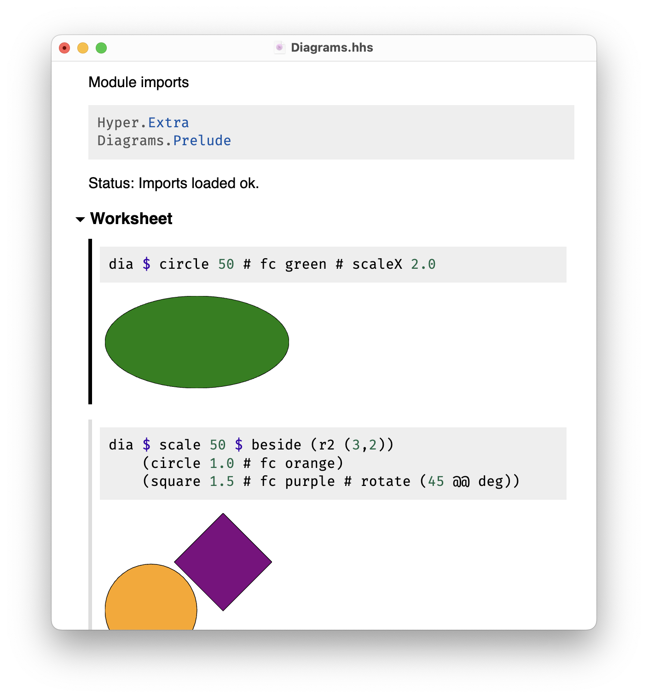
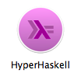

# Welcome to HyperHaskell,   

… the strongly hyped Haskell interpreter.

*HyperHaskell* is a graphical interpreter for the programming language [Haskell][]. You use worksheets to enter expressions and evaluate them. Results are displayed graphically using HTML.

*HyperHaskell* is intended to be *easy to install*. It is cross-platform and should run on Linux, Mac and Windows. Internally, it uses the [GHC][] API to interpret Haskell programs, and the graphical front-end is built on the cross-platform [Electron][] framework.

*HyperHaskell*'s main attraction is a [`Display`][display] class that supersedes the good old [`Show`][show] class. The result looks like this:

  

# Releases

The latest release of *HyperHaskell* is [*Level α* (version 0.1.0.0)](../../releases/tag/v0.1.0.0).

Known Issues:

* At the moment, only Haskell expressions (as opposed to statements) can be parsed and evaluated. #3

  [haskell]: https://haskell.org
  [show]: http://hackage.haskell.org/package/base/docs/Prelude.html#t:Show
  [display]: https://hackage.haskell.org/package/hyper/docs/Hyper.html#t:Display
  [ghc]: https://www.haskell.org/ghc/
  [electron]: http://electron.atom.io/
  [stack]: https://www.haskellstack.org
  [release]: ../../releases

# Installation
## Overview

*HyperHaskell* is intended to be easy to install. The easiest way to install it is to download the binary distribution. This is explained in the next subsection. However, there is a pitfall which you have to know about, and which requires knowledge of the installation structure.

A HyperHaskell installation consists of two parts:

1. The graphical front-end.

    Currently written in HTML and JavaScript, packaged with the [Electron][] framework.

2. The interpreter back-end.

    Consists of an executable `hyper-haskell-server`,
    written in Haskell using the [GHC API][ghc],
    and a library (module) `Hyper` for visualizing and pretty printing Haskell values.

    Both parts depend on several different Haskell packages.
    Unfortunately, the versions of the packages used to compile the executable
    and to compile the library have to be exactly the same.

    This is why, at the moment,
    the front-end does *not* come with the back-end executable included.
    Instead, the user is asked to install the `hyper-haskell-server` back-end
    into his or her own database of Haskell packages,
    and then tell the front-end about it.
    This way, the user is free to use different package or compiler versions.

## Installation of the binary distribution

Installation from the binary distribution follows the structure explained above.

1. [Download the graphical front-end from the latest release][release] und unpack it.

    

    *NOTE*: At the moment, I can only provide macOS binaries, because I don't have access to other architectures. Help is appreciated!

2. Install the back-end server

    1. Make sure that you have a working installation of the [GHC][] Haskell compiler.

    2. Install the back-end with Cabal by executing

            cabal install hyper hyper-haskell-server

      It is also recommended (but not necessary) that you install the additional
      support for other popular Haskell packages, e.g. the [Diagrams][] library by
      additionally executing

            cabal install hyper-extra

    3. Now you can start the front-end application and create a new worksheet, or open an existing one. Make sure that the "Interpreter Back-end" in the "Settings" section of the worksheet is set to "cabal". (The path field does not matter in this case.)

        

        It is also possible to use [Stack][] by using `stack install`, but that is not fully explained here, only to some extend below.

That's it! Happy hyper!

  [diagrams]: https://github.com/diagrams

## Run from source

When developing HyperHaskell itself, it is also possible to run it from source. Follow these steps:

1. [Download and install Electron](http://electron.atom.io/releases/)

    The whole thing is currently developed and tested with Electron v1.4.0.
    
    (If you use the [npm][] package manager, you can install with `npm install electron@1.4.0 -g`.
    On Debian-based Linux distributions, Electron [currently](https://github.com/electron-userland/electron-prebuilt/issues/70#issuecomment-192520913) requires the `nodejs-legacy` package.)

2. Make sure that you have a working installation of
    * the [GHC][] Haskell compiler
    * the [`stack`][stack] utility

    (See the [Haskell homepage][haskell] for more on how to obtain these.)

3. You also need the `make` utility, which should be standard on any UN*X platform. Edit the file named [`Makefile`](Makefile) and tell it where to find the Electron executable

    On macOS: Typically,

        ELECTRON=/Applications/Electron.app/Contents/MacOS/Electron

    On Linux: Typically,
    
        ELECTRON=/usr/local/bin/electron

    On Windows: ??

4. Go into the root directory of this repository and type `make run`.

        $ cd hyper-haskell
        $ make run

    This will call the `stack` utility to build the server back-end,
    and finaly run the front-end.

5. Use the *File* menu to open one of the example worksheets from the [worksheets](worksheets/) folder. Voilà!

    You can also create a new worksheet, but note that you have to set the back-end path in the "Settings" section. The path is relative to the directory where the worksheet was saved. For instance, if you run a worksheet from the [worksheets](worksheets/) directory, the path `../haskell/stack.yaml` will point to the right `hyper-haskell-server` executable. Screenshot:

    

    Note that for this setting, the `stack` utility has to be in your path. You can also set an explicit path for this utility in the "Preferences…" menu item.

## Packaging

The normal way to obtain HyperHaskell is to download the application bundle in binary form. This section describes how to generate this from source.

We use the [`electron-packager`][pkg] utility. To install it, you need to use the [npm][] package manager and execute the following commands

    npm install electron-packager -g
    cd hyper-haskell/app
    npm install electron-prebuilt --save-dev

To create an application bundle, use the following commands:

  * On macOS:

        make pkg-darwin

  * On Windows: not implemented yet
  * On Linux: not implemented yet

  [npm]: https://www.npmjs.com/
  [pkg]: https://github.com/electron-userland/electron-packager

# Contributors

The project was started by *Heinrich Apfelmus*.

Many thanks to Moritz Angermann, Simon Jakobi.
